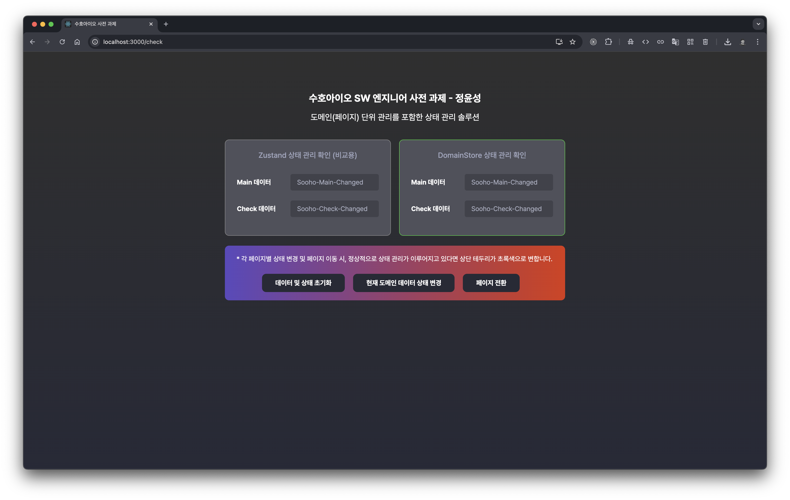
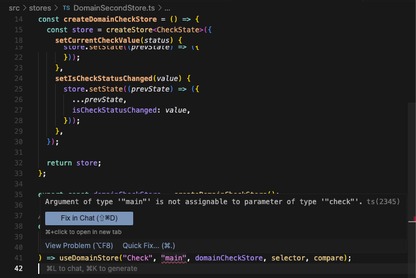

## 수호아이오 SW 엔지니어 사전 과제

### 도메인(페이지) 단위 관리를 포함한 상태 관리 솔루션

해당 레포지토리는 수호아이오 SW 엔지니어 사전 과제를 위한 레포지토리입니다.

기존 zustand가 동작하는 방식에 domain scope 기반의 접근 제어 기능을 추가했으며, 단순 설치 후 실행하여 zustand의 특징과 제안하는 솔루션의 기능을 비교해 볼 수 있습니다. 

또한, 지정된 도메인-store 간에만 상태 관리를 할 수 있기 때문에 매칭되어 있지 않은 내용을 선언할 경우 컴파일 시 에러가 발생하는 것을 확인할 수 있습니다.


### 설치 및 테스트 방법

```shell
# Zustand와 상태 관리 기능 동작이 유사한 지 확인하는 과정
# 설치 방법
1. npm install
2. npm run start

# 상태 관리 동작 테스트 방법
# 참고: 페이지는 /(Main)과 /check(Check)로 나누어집니다.
1. 메인 페이지에서 현재 도메인 데이터 상태 변경 후 변경된 Main 데이터 확인
2. 페이지 전환을 통해 페이지 이동
3. 체크 페이지에서 현재 도메인 데이터 상태 변경 후 변경된 Check 데이터 확인
4. 정상적으로 동작한 경우, 페이지 전환 간에도 zustand와 동일한 데이터가 보이며, 박스 영역에 초록색 테두리가 생김

# 지정되지 않은 도메인에 대한 도메인 가드 테스트 방법
1. DomainFirstStore.ts에서 Main은 main 또는 check fixKey를 적용 가능
2. DomainSecondStore.ts에서 Check는 check fixKey만 적용 가능
3. 정상적으로 동작한 경우, DomainSecondStore.ts에서 check fixKey를 main으로 변경하면 컴파일 에러 발생
```


### 구현 스펙

```text
- OS: MacOS Sequoia 15.6.1
- React: v19.1.1
- TypeScript: v4.9.5
- Node: v16.20.2
- npm: v8.19.4
- zustand: v5.0.8 (비교용)
- AI 활용 도구: ChatGPT (GPT-5), Cursor AI (Auto)
```


### 테스트 결과 화면 스크린샷

**상태 관리 테스트 결과**



**도메인별 상태 관리용 도메인 가드 테스트 결과**


